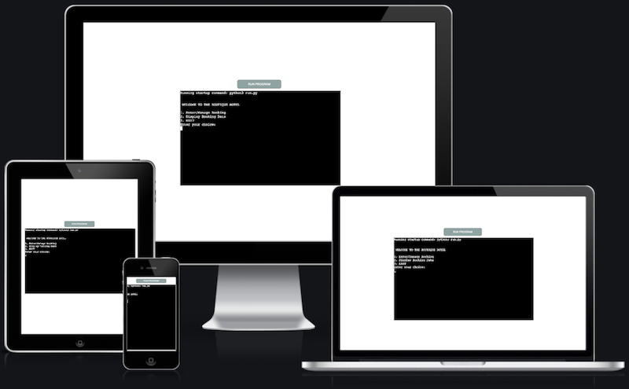
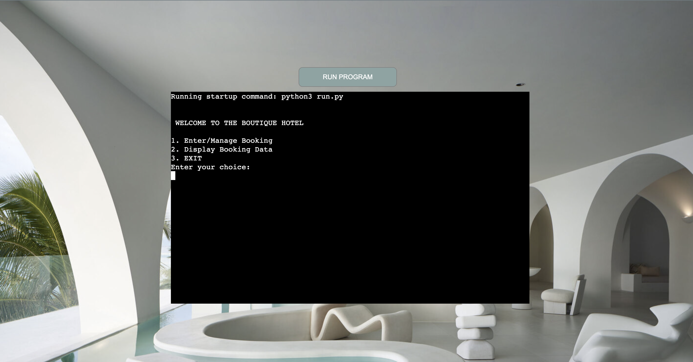
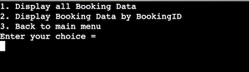
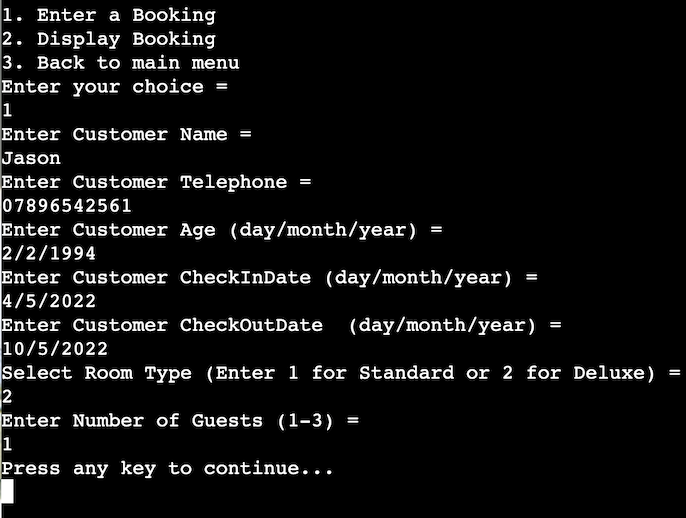
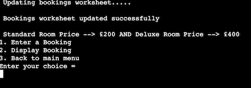
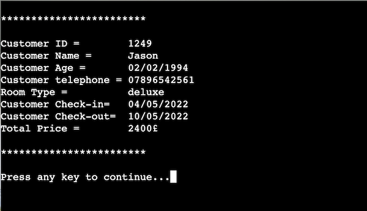
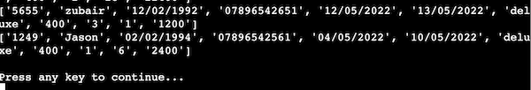
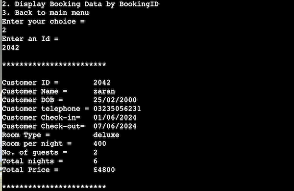
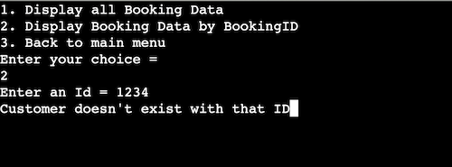

#  The Boutique Hotel

* [Live link](https://the-boutique-hotel.herokuapp.com/) of the project

## Project Overview
In this project I have created a hotel bookings management system that links to a spreadsheet. The user operating the system can create a booking by entering inputs of the client for whom the booking is made. The system ensures correct data is entered within each input by rasising an error if incorrect data or format is entered. The system also generates a total cost to stay at the hotel based on the type of room selected, the number of nights and people. Finallythe system than generates a booking ID for each client and adds it to the spreadsheet. The user can also fetch all bookings to be displayed altogether or display each booking by entering a specific booking ID.

## Table of contents:
* [**The Boutique Hotel**](#the-boutique-hotel)
* [**Project Overview**](#project-overview)
* [**User stories:**](#user-stories)
* [**Design**](#design)
* [**Flowchart**](#Flowchart)
* [**Current Features**](#current-features)
* [**Technology**](#technology)
  * [***Languages***](#Languages)
  * [***Libraries***](#Libraries)
* [**Testing**](#testing)
    * [***test cases***](#test-cases)
    * [**Fixed bugs:**](#fixed-bugs)
* [**Deployment**](#deployment)
  * [**Heroku**](#Heroku)
  * [**Make a clone**](#Clone)
* [**Credits**](#credits)

## User Stories
* As a user I want to use booking management system
* As a user I want to create a customer booking
* As a user I want specific data requirements i.e name, contact no, checkin/checkout to be able to make a distinct booking
* As a user I want to assign a unique booking ID to for each booking
* As a user I want to be able to store bookings in a spreadsheet
* As a user I want to fetch all bookings from the spreadsheet or by booking ID

## Design 
* The project is a terminal based application that opens in web page, with a button to run the program at the top and a background image.

## Flow Chart
* The application follows the following diagram:

## Current Features
* The application runs the main menu home page which displays 3 options the user can choose from:
  1. **Enter/Manage Bookings**
  2. **Display Booking Data**
  3. **Exit**

* **Enter/Manage Bookings**, a booking sub menu opens displaying the room type and price at the tope and 3 options:
  1. **The Enter a booking**
  2. **Display booking**
  3. **Back to main menu**
* **Enter a booking**, the system prompts a series of sequential inputs, NAME, TELEPHONE NO., DATE OF BIRTH, CHECK-IN, CHECK-OUT, ROOM TYPE, and NO. OF GUESTS and saves the data in a spreadsheet.
* Each of these inputs is validated to only accept certain inputs i.e alphabets or digits and formatt.
* **Display booking** displays the booking just created with a unique booking ID and calculates and displays the total cost of the stay based on the number of nights from CHECK-IN, CHECK-OUT, ROOM TYPE, and NO. OF GUESTS.

* **Display Booking Data**, a display sub menu opens with 3 options:
  1. **Display all Booking Data**
  2. **Display Booking Data by BookingID**
  3. **Back to main menu**
* **Display all Booking Data**, display all bookings stored in the spreadsheet
* **Display Booking Data by BookingID**, promopts the user to enter an ID and displays only the booking with that ID.

## Technology
  ### Languages 
  * [HTML:](https://www.w3.org/html/)  - HTML5 provided the skeleton for the project for the display
  * [CSS:](https://www.w3.org/Style/CSS/) - CSS was used to style.CSS was used to manage the UI.
  * [Python](https://www.python.org/) - Used for the main interaction with the user.

  ### Libraies
  * [Git](https://git-scm.com/) - Git was used to managing the code. Allowing me to create backups whenever significant changes were made to code by utilizing the gitpod terminal to commit to Git and Push to GitHub.
  * [GitHub:](https://github.com/) - GitHub was used to externally store repository and site deployment.
  * [Os](https://docs.python.org/3/library/os.html "Link to os homepage") -Os library was used to clear the previous print statement in the terminal.
  * [Datetime](https://docs.python.org/3/library/datetime.html "Link to time homepage") - Time library was used to for check-in/check-out, no. of nights
  * [Random](https://www.programiz.com/python-programming/modules/random "Link to random homepage")- Random library was used to get random booking ID
  * [Am I Responsive?](http://ami.responsivedesign.is/# "Link to Am I Responsive Homepage")- Am I Responsive? was used to see if the site is responsive on different types of devices.
  * [Lucid](https://www.lucidchart.com/) - To create the flow chart 

## Testing
### test cases
* Through out the project I have carried out regular testing using print statments
* A booking system that creates,stores and display bookings
  
* Navigate throught the menu and sub menu

  
  
* Display room price based on type of room
* User is prompted to enter specific data to generate booking 
  
  
* The system runs an error if the type or format is incorrect
  
  
  
* Displays the unique booking ID and calculates total cost of stay
  
* Display all bookings stored within the spread sheet
  
* Display specific booking by booking ID
  

### Fixed bugs
* Broken while loop, when inaccurate booking ID entered, displays error of "Customer doesn't exist with that ID " but does not prompt for ID again.

  
* To resolve the bug I removed the while loop and recalled the functions within its self at the end of the code block with in the **else** of an **if/else** statement.

  

## Deployment
### Heroku
* The project was deployed using [Heroku](https://www.heroku.com)
*  Navigate to your [heroku dashboard](https://dashboard.heroku.com/apps)
- Click "New" and select "Create new app".  
- Input a meaningful name for your app and choose the region best suited to
  your location.  
- Select "Settings" from the tabs.  
  - Click "Reveal Config Vars".  
  - Input `PORT` and `8000` as one config var and click add.  
  - Input `CREDS` and the content of your Google Sheet API creds file as another
    config var and click add.  
  - Click "Add buildpack".  
  - Add "nodejs" and "python" from the list or search if necessary, remember to
    click save.  
  - Python must be the first buildpack. They can be dragged into the correct
    position if needed.  
- Select "Deploy" from the tabs.  
  - Select "GitHub - Connect to GitHub" from deployment methods.  
  - Click "Connect to GitHub" in the created section.  
  - Search for the GitHub repository by name.  
  - Click to connect to the relevant repo.  
  - Either click `Enable Automatic Deploys` for automatic deploys or `Deploy
    Branch` to deploy manually. Manually deployed branches will need
    re-deploying each time the repo is updated.  
  - Click `View` to view the deployed site.  
- The live site can also be accessed from your repo in GitHub from the
  environments section of the repo.
  - Click the link to view deployments history.  
  - Click `View deployment`. This page also shows all the deployment history.  
The site is now live and operational

### Make a clone
- [Login](https://github.com/) to GitHub
  - Click "Repository" and select "project"
	- Click the "Code" dropdown menu.
  - Click "Clone with HTTPS" and copy the link
	- Open IDE "Ternimal" in local machine
  - Type "git clone" followed by URL
  - Press "Enter" to create clone

## Credits
* My friend Abu Bakar for his time helping me explain code logic flows and methodology 
* Rohit Sharma, my mentor, for keeping me on track at different stages of the project and pace my work feature by feature.
* [pynative](https://pynative.com/) helped me go over concepts and examples 
